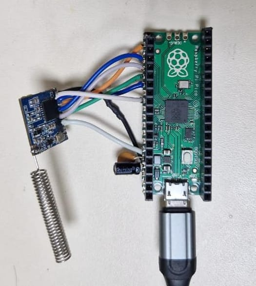
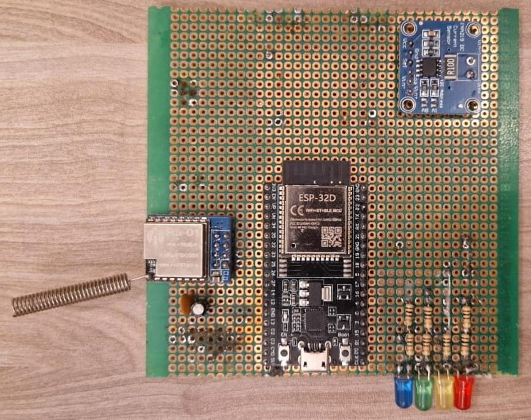
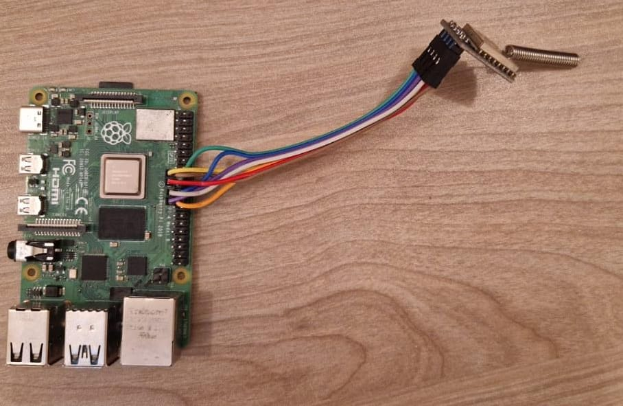
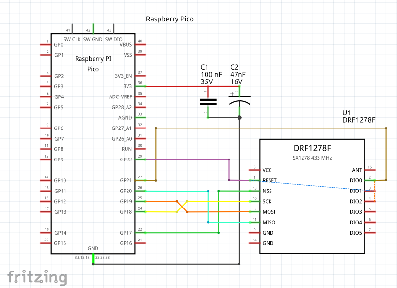
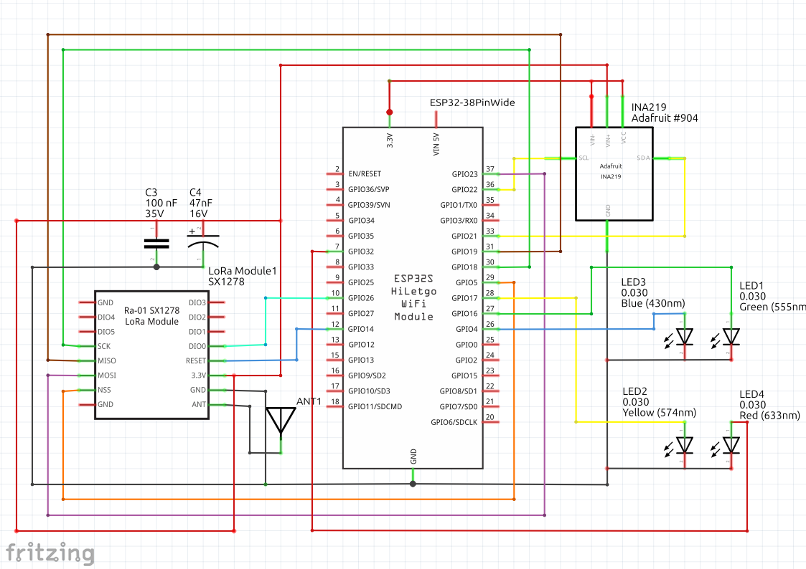
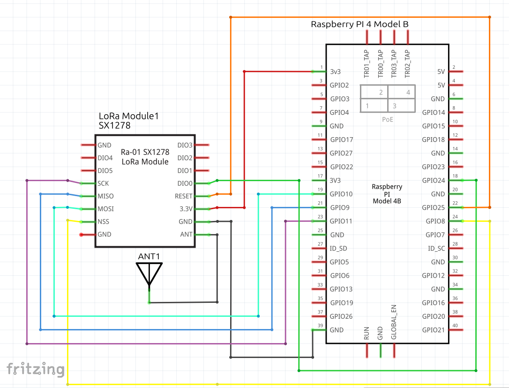
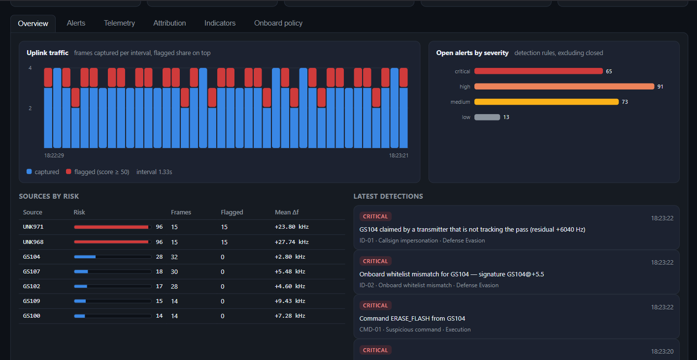

# Honeypot CubeSat CTI

A bench prototype of a **space cyber-threat-intelligence (CTI) platform built
on honeypot CubeSats**: a decoy satellite listens to its uplink, measures and
scores every frame it receives, fingerprints the transmitter, and sends its
records to a ground station that turns them into alerts, attacker profiles
and shareable indicators. The same board, switched to member mode, becomes
the accept/block gate a protected satellite would run.

The bench runs the whole chain over a real radio link with three low-cost
nodes: a Raspberry Pi Pico that plays ground stations and attackers, an ESP32
honeypot node, and a Raspberry Pi 4 ground station with a web portal.

| Uplink transmitter | Honeypot node | CTI ground station |
|---|---|---|
|  |  |  |
|  |  |  |
| Raspberry Pi Pico + DRF1278F | ESP32 + Ra-01 + INA219 | Raspberry Pi 4 + Ra-01 |

## Contents

- [How it works](#how-it-works)
- [Results](#results)
- [Repository layout](#repository-layout)
- [Quick start without hardware](#quick-start-without-hardware)
- [Building the bench](#building-the-bench)
- [Running a session](#running-a-session)
- [Detection in brief](#detection-in-brief)
- [Reproducing the results](#reproducing-the-results)
- [Limitations](#limitations)
- [Documentation](#documentation)
- [Safety and regulations](#safety-and-regulations)
- [Background](#background)
- [License](#license)

## How it works

The concept has three parts:

- **Honeypot satellites** look like ordinary CubeSats, accept a small set of
  harmless commands, and record the RF metadata of every uplink frame,
  valid or not. They are the sensors of the network.
- The **ground platform** receives their records, analyses them, and builds
  the CTI database: alerts, attacker profiles, transmitter signatures.
- **Member satellites** run the same board as a gate: before a command is
  executed, the board checks it against the ground-built blocklist and its
  own allowlist, and answers accept or block.

The bench maps these onto three nodes:

```
  Uplink transmitter             Honeypot node                     CTI ground station
  Raspberry Pi Pico + DRF1278F   ESP32 + Ra-01 + INA219            Raspberry Pi 4 + Ra-01
 ┌─────────────────────────┐    ┌────────────────────────────┐    ┌────────────────────────────┐
 │ five ground stations    │    │ carrier offset (AFC), RSSI │    │ cti_receiver               │
 │ and five attack types   │    │ 7-indicator anomaly score  │    │ hny_server.py:             │
 │ AX.25 UI frames, 2-FSK  │───▶│ fuzzy transmitter match    │───▶│  SQLite, pass fit,         │
 │ 433.5 MHz, 2 dBm        │ RF │ fingerprint whitelist      │ RF │  9 detection rules,        │
 │ simulated pass Doppler  │    │ record stored in flash     │    │  profiles, STIX/MISP/CSV   │
 └─────────────────────────┘    │ member mode: accept/block  │    │ web portal on port 8700    │
          uplink                └────────────────────────────┘    └────────────────────────────┘
                                   downlink of stored records
```

All three radios are SX1278 transceivers driven by the same library
(RadioLib 7.7.1) and the same framing and detection code
(`libraries/HnyProto`), so the ground station also serves as a reference
receiver for the uplink.

A flight version, a 1U CubeSat plug-in board with the same ESP32 and a single
SX1278 receiver on one antenna, has been designed but not built. Everything
in this repository, and every number below, is from the bench.

## Results

From the bench campaign of 25 September 2026 (raw data in
[`data/`](data/2026-09-25-campaign), analysis in
[docs/reproducing.md](docs/reproducing.md)):

| Measurement | Result |
|---|---|
| Uplink capture, 15-minute scenario | 128 of 147 frames (87 %); 119 of 120 before the bench was physically disturbed |
| Carrier-offset accuracy, Doppler-free frames | −0.06 ± 0.20 kHz; 53 of 53 within ±0.4 kHz |
| Onboard processing per frame (ESP32, 240 MHz) | 290 µs mean, 347 µs max (x86_64 desktop: 195 µs) |
| Downlink of the stored records | 148 of 148, in each of two passes |
| Ground analysis | every attack record raised at least one alert, impersonations critical ones; no legitimate record flagged |
| Member mode | 11 of 11 frames from blocklisted sources blocked; 22 of 23 legitimate frames accepted |
| Honeypot throughput | 97 % capture at 0.9 s frame spacing, 9 % at 0.5 s |
| Radio power (Ra-01 supply) | 52 mW receiving, 228 mW transmitting at 2 dBm |
| Synthetic dataset (150 packets) | 32 of 32 injected attacks detected, no false positives |



## Repository layout

```
firmware/
  honeypot_node/          ESP32: capture, score, fingerprint, store, downlink; member mode
  uplink_transmitter/     Pico: five ground stations and five attack types
  link_test/              Pico: numbered frames for link measurement and calibration
libraries/HnyProto/       shared header-only library: AX.25, registry, detection, record formats
ground_station/
  receiver/               cti_receiver: Raspberry Pi downlink receiver (C++, RadioLib + lgpio)
  server/                 hny_server.py, cti_engine.py, web portal, systemd unit
simulation/               synthetic-data pipeline: generator, detector, figures, dashboard
analysis/                 bench logger and the scripts behind the published figures
data/2026-09-25-campaign/ raw logs and ground database of the bench campaign
tools/uplink_monitor/     live view of the transmitted uplink (runs next to the Pico)
hardware/                 Fritzing sketches of the three nodes and a DRF1278F part
docs/                     hardware, firmware, ground station, protocol, detection, reproduction
```

## Quick start without hardware

The ground server and portal run on any computer with Python 3.10 or newer,
driven by the synthetic dataset:

```sh
git clone https://github.com/Jamil-Jafarli/cti_cubesat.git
cd cti_cubesat
pip install -r simulation/requirements.txt
cd ground_station/server
python3 hny_server.py --simulate --reset
# open http://127.0.0.1:8700
```

To re-run the detection pipeline on the synthetic data and produce its
figures, run `python3 export.py` in `simulation/`. For the Streamlit
dashboard, run `streamlit run dashboard.py` there.

## Building the bench

### Parts

| Node | Parts |
|---|---|
| Uplink transmitter | Raspberry Pi Pico, Dorji DRF1278F (SX1278, 433 MHz) |
| Honeypot node | ESP32-WROOM-32D DevKit, Ai-Thinker Ra-01 (SX1278, 433 MHz), INA219 breakout (0.1 Ω shunt), red / amber / green / blue LEDs with 300 / 200 / 300 / 200 Ω resistors |
| CTI ground station | Raspberry Pi 4 Model B, Ai-Thinker Ra-01 |
| Each radio | 100 nF ceramic + 10–47 µF electrolytic across 3.3 V and GND at the module; 17.3 cm wire antenna |

The radio modules are 3.3 V only and have 1.27 mm pads; solder thin wires to
them. The full bill of materials and notes on power, decoupling and antennas
are in [docs/hardware.md](docs/hardware.md).

### Wiring

**Uplink transmitter** (DRF1278F → Pico)

| DRF1278F | SCK | MOSI | MISO | NSS | RESET | DIO0 | VCC | GND |
|---|---|---|---|---|---|---|---|---|
| Pico | GP18 | GP19 | GP20 | GP17 | GP22 | GP21 | 3V3(OUT) | GND |


**Honeypot node** (Ra-01, INA219, LEDs → ESP32)

| Ra-01 | SCK | MISO | MOSI | NSS | RESET | DIO0 | 3.3V | GND |
|---|---|---|---|---|---|---|---|---|
| ESP32 | IO18 | IO19 | IO23 | IO5 | IO14 | IO26 | via INA219 (below) | GND |

| INA219 | VIN+ | VIN− | VCC | GND | SDA | SCL |
|---|---|---|---|---|---|---|
| connects to | ESP32 3V3 | Ra-01 3.3V | ESP32 3V3 | GND | IO21 | IO22 |

| LED (anode via resistor, cathode to GND) | red | amber | green | blue |
|---|---|---|---|---|
| ESP32 | IO32 | IO17 | IO16 | IO4 |


**CTI ground station** (Ra-01 → Raspberry Pi 4; header pin in brackets)

| Ra-01 | SCK | MISO | MOSI | NSS | RESET | DIO0 | 3.3V | GND |
|---|---|---|---|---|---|---|---|---|
| Pi 4 | GPIO11 (23) | GPIO9 (21) | GPIO10 (19) | GPIO8 / CE0 (24) | GPIO25 (22) | GPIO24 (18) | 3V3 (17) | GND (20) |


The ground-station schematic draws the radio with the DRF1278F symbol; the
bench uses a Ra-01 with the same connections. The Fritzing sources of all
three schematics are in [`hardware/`](hardware).

### Firmware

Tested with the esp32 core 2.0.17, the arduino-pico (rp2040) core 6.1.0 and
RadioLib 7.7.1:

```sh
arduino-cli config add board_manager.additional_urls \
  https://github.com/earlephilhower/arduino-pico/releases/download/global/package_rp2040_index.json
arduino-cli core update-index
arduino-cli core install esp32:esp32@2.0.17 rp2040:rp2040@6.1.0
arduino-cli lib install RadioLib@7.7.1

arduino-cli compile -b esp32:esp32:esp32 --library libraries/HnyProto firmware/honeypot_node
arduino-cli upload  -b esp32:esp32:esp32 -p /dev/ttyUSB0 firmware/honeypot_node

arduino-cli compile -b rp2040:rp2040:rpipico --library libraries/HnyProto firmware/uplink_transmitter
arduino-cli upload  -b rp2040:rp2040:rpipico -p /dev/ttyACM0 firmware/uplink_transmitter
```

With the Arduino IDE, copy `libraries/HnyProto` into your sketchbook's
`libraries` folder and install RadioLib 7.7.1 from the Library Manager.
See [docs/firmware.md](docs/firmware.md) for configuration, serial output and
calibration.

### Ground station

On the Raspberry Pi (Raspberry Pi OS):

```sh
sudo apt install git cmake g++ liblgpio-dev python3
sudo raspi-config nonint do_spi 0
git clone https://github.com/Jamil-Jafarli/cti_cubesat.git ~/cti_cubesat
~/cti_cubesat/ground_station/receiver/build.sh
cd ~/cti_cubesat/ground_station/server
python3 hny_server.py --radio --host 0.0.0.0
# portal: http://<pi-address>:8700
```

To start it at boot, adjust and install `ground_station/server/cti-server.service`
(see [docs/ground-station.md](docs/ground-station.md)).

### Calibration

The two radios' crystals differ by a few kHz, and the difference changes when
a module is replaced or resoldered. Measure it once on your bench with
`firmware/link_test` and `analysis/linktest_analysis.py`, and set `CALIB_HZ`
in `firmware/honeypot_node/honeypot_node.ino`
([procedure](docs/firmware.md#calibration)). A calibrated node reads
Doppler-free frames to within ±0.4 kHz.

## Running a session

1. Power the three nodes 1–2 m apart, each with its antenna.
2. Open the honeypot's serial monitor (115200 baud). At boot it reports the
   INA219, the noise floor and its RSSI trigger level.
3. Let the uplink transmitter run. Every frame the honeypot receives prints an
   `[rx]` line with the measured offset, score, class and whitelist state, and
   the LEDs show the last verdict. `tools/uplink_monitor` shows the
   transmitted side live.
4. Stop the transmitter and send `D` to the honeypot (or press BOOT). Its
   stored records are downlinked, analysed on the ground and shown in the
   portal.

Honeypot serial commands:

| Key | Action |
|---|---|
| `D` | downlink every stored record |
| `S` | status JSON: store, receiver counters, processing time, heap, stack |
| `E` | erase the record store |
| `R` | reset the timing counters |
| `M` | toggle honeypot / member mode |
| `F` / `A` / `X` | show the whitelist / enrol the last transmitter / clear the whitelist |
| `P` | radio power profile (receive, standby, sleep, 2 dBm carrier) via the INA219 |
| `Q` | RSSI scan of 433.40–433.60 MHz (all transmitters off) |

## Detection in brief

Every frame gets an anomaly score of 0–100 from seven weighted indicators;
50 or more flags it:

| Indicator | Fires when | Weight |
|---|---|---:|
| Frequency deviation | carrier more than 20 kHz off the centre | 25 |
| Doppler mismatch | Doppler residual larger than 700 Hz | 25 |
| Unexpected modulation | modulation differs from the expected profile | 15 |
| Suspicious command | e.g. `REBOOT`, `ERASE_FLASH`, an unknown opcode | 15 |
| Malformed packet | AX.25 FCS does not verify | 10 |
| Unknown source | callsign not in the registry | 5 |
| Probing | less than 2 s since the previous frame | 5 |

Independently, a fuzzy match against the ground-station registry classifies
the transmitter as known, suspicious or attacker:

```
S = 0.45 · (1 − |Δfreq| / 25 kHz) + 0.25 · (1 − |Δdrift| / 1 ppm) + 0.30 · [modulation matches]
```

A callsign is only text, so the honeypot binds each whitelisted callsign to
the carrier offset its real transmitter uses (the **transmitter signature**,
e.g. `GS104@+0.0`). A frame that carries an enrolled callsign from a
different radio is reported as a whitelist mismatch, and in member mode it
loses the allowlist override.

On the ground, the server fits the pass to all records, recomputes every
score, and runs nine rules (off-frequency carrier, Doppler residual, callsign
impersonation, whitelist mismatch, suspicious command, unregistered source,
probing burst, malformed frame, sustained campaign). It groups records into
source profiles with a risk score and offers callsigns, signatures and
commands as indicators with confidence and TLP marking, exportable as
STIX 2.1, MISP or CSV. Details: [docs/detection.md](docs/detection.md).

## Reproducing the results

```sh
cd analysis
python3 scenario_analysis.py ../data/2026-09-25-campaign/scenario_run.json ../data/2026-09-25-campaign/ground.db
python3 member_analysis.py   ../data/2026-09-25-campaign/member_run.json
python3 linktest_analysis.py ../data/2026-09-25-campaign/linktest_900ms.json
```

These reproduce the numbers in [Results](#results) from the raw campaign
data. [docs/reproducing.md](docs/reproducing.md) shows the expected output and
how to run the same measurements on your own bench.

## Limitations

- **Synthetic and scripted evaluation.** The detection rates come from a
  synthetic dataset whose anomalies follow the same features the detector
  scores, and the bench scenarios were written by us. Neither reflects an
  adaptive, real attacker.
- **Prototype figures.** All measurements are from a classic ESP32 and one
  SX1278 per node. The power of the whole node was not measured (only the
  radio's), and capture depended on the physical state of the bench.
- **Throughput.** The honeypot scores, fingerprints and writes each frame to
  flash before it listens again, so it loses most frames sent faster than
  about one per second. A transmitter can use this to blind it. Buffering
  records in RAM and writing them off the receive path is the obvious fix and
  is not implemented.
- **Modulation.** An SX127x packet receiver decodes only its own modulation,
  so the unexpected-modulation indicator never fires on the bench. It needs a
  receiver with IQ output or an SDR.
- **Fingerprint resolution.** The bench measures the carrier offset to about
  0.4 kHz and cannot measure oscillator drift, while the registry assumes
  sub-kHz signatures. The 1:N fuzzy match only works on a small,
  mission-specific registry; a decision about a claimed identity should rest
  on the 1:1 whitelist check.
- **Onboard Doppler estimate.** Without an orbit model the honeypot estimates
  the pass Doppler from the cooperating stations. The estimate lags the
  fastest part of the pass, needs about 20 s after a restart, and assumes the
  cooperating stations are the majority of the traffic.
- **Whitelist enrolment** is trust on first use.
- **Not implemented:** distribution of the CTI blocklist to member
  satellites, transmitter geolocation from the Doppler curve, a TAXII server,
  authentication of the portal and API.

## Documentation

| Document | Content |
|---|---|
| [docs/hardware.md](docs/hardware.md) | bill of materials, wiring, schematics, power, antennas, Fritzing files |
| [docs/firmware.md](docs/firmware.md) | toolchain, build and upload, configuration, serial commands and output, calibration |
| [docs/ground-station.md](docs/ground-station.md) | Raspberry Pi setup, server options, systemd, portal, HTTP API, troubleshooting |
| [docs/protocol.md](docs/protocol.md) | radio channel, AX.25 frames, record and downlink formats |
| [docs/detection.md](docs/detection.md) | indicators, fuzzy match, signatures and whitelist, member mode, ground rules, profiles, indicators |
| [docs/reproducing.md](docs/reproducing.md) | reproducing every published figure from the raw data, and on your own bench |

## Safety and regulations

The bench transmits at 2 dBm on 433.5 MHz, inside the 433.05–434.79 MHz ISM
band, over a distance of 1–2 m. Check the rules for short-range devices in
your country before transmitting, and always connect an antenna before a
radio transmits. The flight concept uses the amateur-satellite band, which
requires a licence. This project is for research and education: do not
transmit to satellites you do not operate.

## Background

The bench was built for the paper *Space Cyber Threat Intelligence Platform
Using Honeypot CubeSats for Attacker Identification*, prepared for the
International Astronautical Congress (IAC 2026).

The project builds on RadioLib, lgpio, Streamlit, pandas and matplotlib, and
on community Fritzing parts for the Ra-01, ESP32 DevKit, INA219 and
Raspberry Pi Pico.

## License

MIT, see [LICENSE](LICENSE). Third-party components (RadioLib, lgpio, the
Python packages and the community Fritzing parts) keep their own licences.
