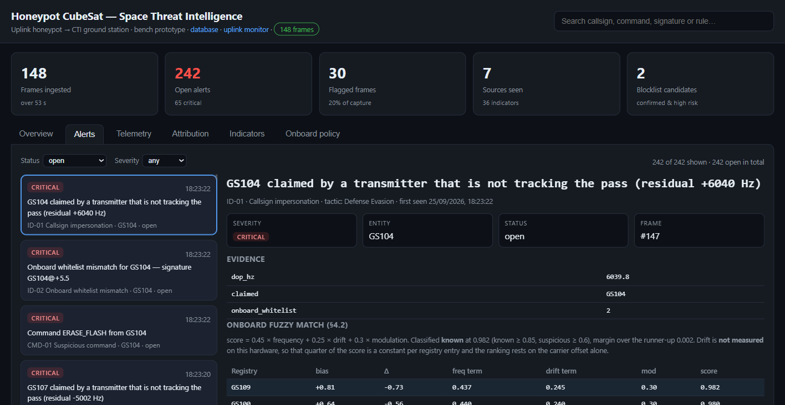
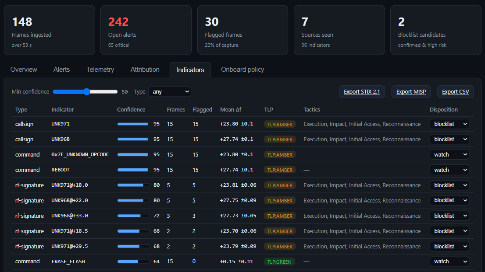

# CTI ground station

The ground station is a Raspberry Pi 4 with a Ra-01 radio on its SPI bus. Two
programs run on it:

- `ground_station/receiver/`: **cti_receiver**, a small C++ program (RadioLib
  over lgpio) that receives the honeypot's downlink and prints one
  `CTI,<csv>` line per record;
- `ground_station/server/`: **hny_server.py**, which starts the receiver,
  stores the records in SQLite, runs the ground analysis and serves the
  threat-intelligence portal on port 8700.

The server needs only the Python standard library. The portal also runs
without any hardware in simulation mode.

## Setup

On Raspberry Pi OS (64-bit recommended):

```sh
sudo apt install git cmake g++ liblgpio-dev python3
sudo raspi-config nonint do_spi 0        # enable SPI; /dev/spidev0.0 must appear
sudo usermod -aG spi,gpio "$USER"        # log out and in again afterwards

git clone https://github.com/Jamil-Jafarli/cti_cubesat.git ~/cti_cubesat
cd ~/cti_cubesat/ground_station/receiver
./build.sh                               # fetches RadioLib 7.7.1, builds build/cti_receiver
```

Wire the Ra-01 as described in [hardware.md](hardware.md#cti-ground-station-ra-01--raspberry-pi-4).

## Running

```sh
cd ~/cti_cubesat/ground_station/server
python3 hny_server.py --radio --host 0.0.0.0
```

Open `http://<pi-address>:8700` from any machine on the network. The receiver
measures the noise floor when it starts and sets its trigger 15 dB above it.
Every minute it prints an `alive` line with its counters and the RSSI range
it saw, so a silent radio is easy to spot in the log.

| Option | Meaning |
|---|---|
| `--radio [BIN]` | start the Pi receiver (default `../receiver/build/cti_receiver`) and read its records |
| `--serial PORT` | read `CTI,<csv>` lines from a receiver on a serial port instead (needs pyserial) |
| `--simulate` | no hardware: fill the portal from the synthetic pipeline in `simulation/` |
| `--n N` | number of simulated packets (default 150) |
| `--rssi-threshold DBM` | fixed receiver trigger level instead of floor + 15 dB |
| `--host`, `--port` | portal address (default 127.0.0.1:8700); use `--host 0.0.0.0` for the LAN |
| `--reset` | delete the database before starting |
| `--analyse` | re-run the ground analysis over the stored records and exit |

The database is `ground_station/server/bench_cti.db`. When the downlink goes
quiet for two seconds, the server runs the ground analysis
([detection.md](detection.md#ground-analysis)) over what arrived.

### Simulation mode

```sh
pip install -r simulation/requirements.txt
cd ground_station/server
python3 hny_server.py --simulate --reset
```

This fills the portal with the 150-packet synthetic dataset, so the portal
and the API can be explored without any radio.

### Start at boot (systemd)

Edit `User`, `Group` and `WorkingDirectory` in
`ground_station/server/cti-server.service` for your Pi, then:

```sh
sudo cp ground_station/server/cti-server.service /etc/systemd/system/
sudo systemctl daemon-reload
sudo systemctl enable --now cti-server
journalctl -u cti-server -f
```

`KillMode=control-group` stops the receiver together with the server, so SPI
and the GPIO lines are released on restart.

## The portal


| View | Shows |
|---|---|
| Overview | traffic over time (flagged frames on top), open alerts by severity, sources by risk, latest detections |
| Alerts | the alert queue with filters; each alert shows its evidence and the onboard fuzzy match term by term; open → acknowledged → closed |
| Telemetry | every stored frame with its RF metadata, onboard and ground scores |
| Attribution | source profiles with risk, first and last seen, commands and signatures |
| Indicators | callsigns, transmitter signatures and commands with confidence, TLP and disposition; export as STIX 2.1, MISP or CSV |
| Onboard policy | the allowlist and blocklist the satellite enforces next to what the ground now proposes, and the difference |





A separate database page (`/db.html`) lists, edits and deletes stored records.

## HTTP API

All responses are JSON unless noted.

| Method | Path | Returns / does |
|---|---|---|
| GET | `/api/state` | KPIs, the latest 200 frames and the source profiles |
| GET | `/api/packets` | stored records |
| GET | `/api/alerts?status=open` | alert queue (`open`, `ack`, `closed` or `all`) |
| GET | `/api/indicators` | indicator set with confidence, TLP and disposition |
| GET | `/api/attribution` | source profiles |
| GET | `/api/timeseries` | traffic per interval |
| GET | `/api/policy` | onboard lists vs ground proposal |
| GET | `/api/analysis/<id>` | full analysis of one record, including the fuzzy-match breakdown |
| GET | `/api/export/stix?min_confidence=50` | STIX 2.1 bundle |
| GET | `/api/export/misp?min_confidence=50` | MISP event |
| GET | `/api/export/csv` | indicators as CSV |
| POST | `/api/analyse` | re-run the ground analysis |
| POST | `/api/alert/<id>` | change an alert's status, body `{"status": "open" \| "ack" \| "closed"}` |
| POST | `/api/indicator` | set a disposition, body `{"value": ..., "status": "watch" \| "blocklist" \| "allowlist" \| "dismissed", "note": ...}` |
| POST | `/api/packet/<id>` | edit a record |
| DELETE | `/api/packet/<id>` | delete a record |
| POST | `/api/reset` | empty the database |

The API has no authentication. Keep the portal on a trusted network.

## Log output

The receiver's lines are echoed by the server. From the 2026-09-25 campaign
downlink:

```
[server] stored: GS104 ERASE_FLASH onboard_score=15 known
[server] stored: GS104 PING onboard_score=0 known
[server] stored: UNK971 0x7F_UNKNOWN_OPCODE onboard_score=70 attacker
[gs] alive rx=148 cti=148 dropped=0 ignored=0 restarts=0 stuck=0 reinit=0 rssi_min=-101 rssi_max=-49
```

| Line | Meaning |
|---|---|
| `[gs] ok — listening ...` | receiver ready, with the measured noise floor and trigger level |
| `CTI,<csv>` | one downlinked record (stored by the server and echoed as `[server] stored: ...`) |
| `[gs] frame dropped: ...` | PHY CRC or AX.25 FCS failed |
| `[gs] ignoring frame SRC -> DST ... info=...` | a frame that is not part of the downlink, logged in full with its carrier offset; this makes the ground station a reference receiver for link tests |
| `[gs] alive ...` | counters every minute: frames received, records, drops, ignored frames, watchdog restarts, RSSI range |

## Troubleshooting

| Symptom | Check |
|---|---|
| `radio init FAILED, code -2` | wiring (MISO, SCK, NSS), 3.3 V at the module, SPI enabled |
| receiver starts, but nothing arrives | antennas, both nodes on 433.5 MHz, the honeypot's `D` command; the `alive` line's `rssi_max` shows whether anything is heard |
| `frame dropped: PHY CRC failed` | weak or disturbed link: move the boards, check the antennas and the decoupling capacitors |
| `Permission denied` on SPI or GPIO | add the user to the `spi` and `gpio` groups, or run the systemd service |
