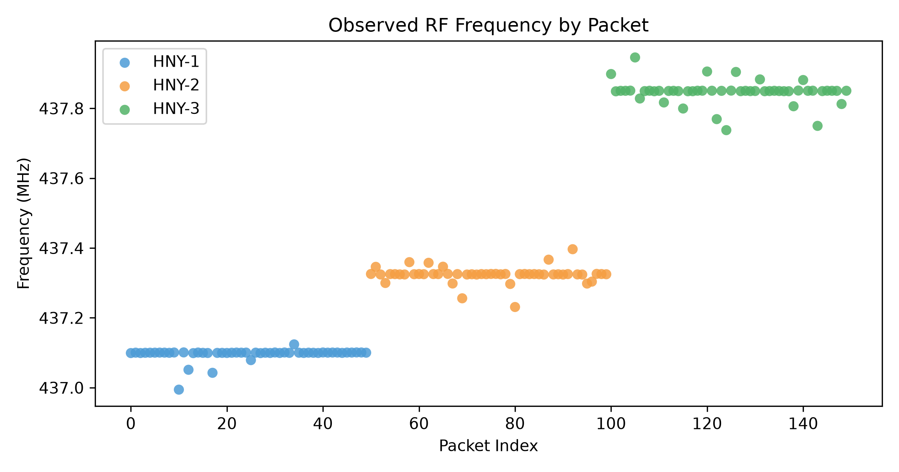

# Simulation

The synthetic-data version of the detection pipeline: it generates labelled
uplink telemetry for three simulated honeypot satellites, scores it with the
same indicators and fuzzy match as the firmware, and produces CTI records,
figures and a dashboard.

| File | Content |
|---|---|
| `profiles.py` | node frequencies, ground-station registry, indicator weights and thresholds |
| `generator.py` | synthetic telemetry: legitimate passes with Doppler and drift, and injected attacks |
| `detector.py` | anomaly score, fuzzy transmitter match, CTI records, evaluation |
| `database.py` | SQLite storage of CTI records |
| `export.py` | the whole pipeline: data, records, figures and the evaluation printout |
| `profile_resources.py` | processing time, memory and throughput of the pipeline |
| `dashboard.py` | Streamlit dashboard |

```sh
pip install -r requirements.txt
python3 export.py                  # writes data/ and out/, prints the evaluation
python3 profile_resources.py       # timing on this machine
streamlit run dashboard.py         # interactive dashboard
```

The ground server's `--simulate` mode imports `generator.py` and `detector.py`
from here to fill the portal without hardware.


